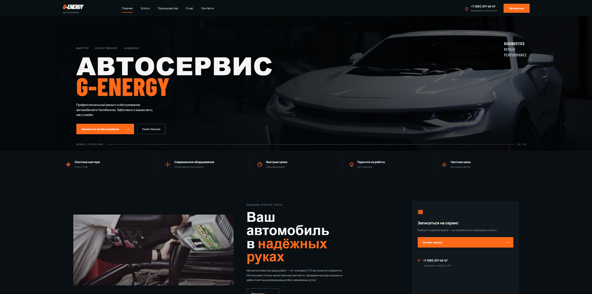

# G-Energy

> Modern energy brand website concept with a bold visual identity and responsive layout.

<p align="center">
  
</p>

## ✨ About

G-Energy is a modern landing page concept focused on strong visual presentation, clean structure and responsive design.

The project was built from scratch using vanilla web technologies without heavy frameworks.

## 🚀 Features

- Responsive layout
- Modern visual design
- Custom animations and interactions
- Clean HTML structure
- Adaptive styling for different screen sizes

## 🛠️ Built With

- HTML5
- CSS3
- JavaScript

## 🌐 Live Demo

**[Open G-Energy](https://g-energy-ten.vercel.app/)**

## 📁 Project Structure

```text
g-energy/
├── index.html
├── styles.css
├── app.js
└── preview.png
```

## 📌 Status

Completed concept project.

---

Made with passion for web design and development.